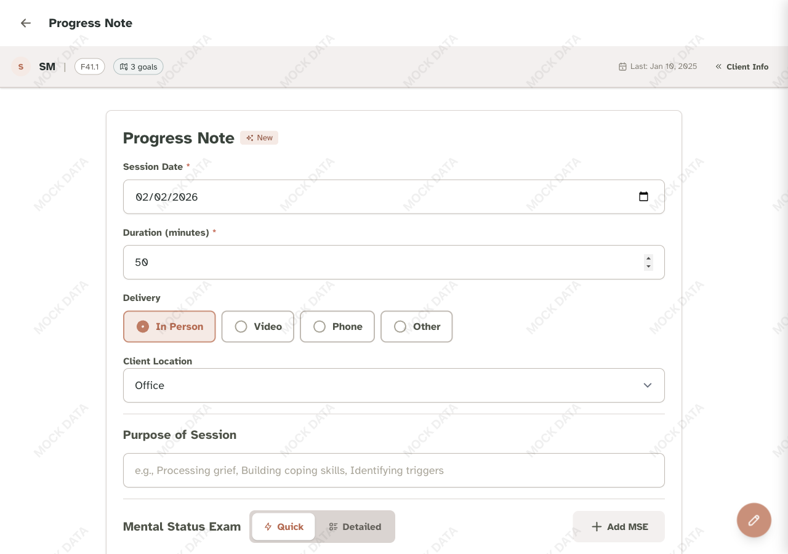
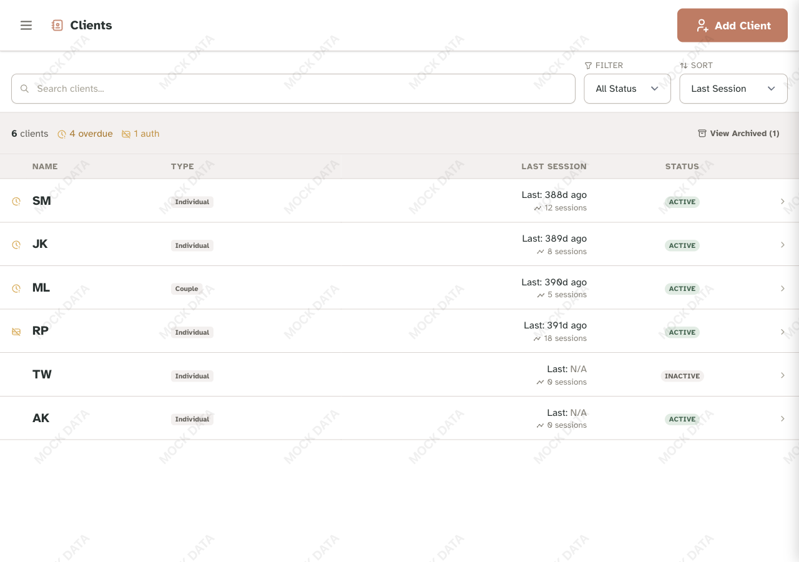

# Therapy Docs Frontend

> **Portfolio Demo**: This is a sanitized version of a production therapy documentation application built for a mental health practice. All patient data shown is fictional - no real PHI is used. The app demonstrates HIPAA-ready design patterns and modern frontend architecture.

A professional, accessible therapy session note-taking application built with Alpine.js and Tailwind CSS v4.

|  |  |
|:--:|:--:|
| *Progress Note Form* | *Client Dashboard* |

## Technical Architecture

This project showcases several interesting architectural decisions:

### Frontend-Only with Mock/Real API Toggle
The entire application works without a backend. A single config flag (`useMockAPI`) switches between mock data and real AWS services - perfect for demos, development, and production with zero code changes.

```javascript
// Toggle between mock and real AWS backend
const config = { useMockAPI: true };
```

### ES Modules Without a Bundler
No webpack, no Vite, no build complexity. The app uses native ES modules with explicit imports, resulting in a simpler toolchain and faster iteration cycles. Each HTML page has a single entry point that imports its dependencies.

### Alpine.js + Tailwind CSS v4
A lightweight, reactive stack optimized for tablet use during therapy sessions:
- **Alpine.js** (~15KB) provides reactivity without virtual DOM overhead
- **Tailwind v4** uses native CSS with design tokens for smaller output
- No framework lock-in - easy to understand and modify

### Unified Documents Model
All clinical documentation (progress notes, diagnoses, treatment plans, intake forms) uses a single `documents` collection with a `documentType` discriminator. This simplifies queries, reduces API surface area, and makes adding new document types trivial.

### Streaming AI Narratives
Progress notes are transformed into clinical narratives using AWS Bedrock (Claude). The UI streams tokens in real-time via Server-Sent Events, providing immediate feedback during generation.

### Optional: Real AI via Cloudflare Worker
The `workers/narrative/` directory contains a Cloudflare Worker that proxies requests to Claude's API for real narrative generation. This enables the demo to show actual AI-generated clinical text while keeping everything else mocked. Deploy with `wrangler deploy`, then set `useRealAI: true` in config. The frontend works without it (falls back to mock AI responses).

---

## HIPAA-Ready Design Patterns

This application demonstrates security patterns appropriate for healthcare software:

### Role-Based Access Control
Three distinct roles with different permissions:
| Role | Capabilities |
|------|-------------|
| `admin` | Full access, can manage supervisors |
| `supervisor` | View-only clinical access for oversight |
| `sysadmin` | System management, PHI redacted |

### Authentication & Session Security
- MFA enforcement via AWS Cognito (TOTP)
- Secure session handling with JWT tokens
- Configurable session timeouts
- Admin-initiated MFA reset for account recovery

### Security Headers (CSP)
CloudFront response headers policy includes:
- Content Security Policy (with necessary Alpine.js accommodations)
- HSTS enforcement
- Clickjacking protection via `frame-ancestors 'none'`
- See `docs/adr/004-cloudfront-security-headers.md` for full rationale

### Audit-Ready Design
- Document versioning with timestamps
- All modifications tracked with user attribution
- Structured data model supports compliance reporting

---

## Features

- 🔐 Secure authentication with AWS Cognito (MFA support)
- 📝 Session note creation and management
- 🤖 AI-powered session summaries via AWS Bedrock
- 📊 Client history and previous session tracking
- ♿ WCAG 2.1 AA compliant
- 📱 Fully responsive design
- 🎨 Professional healthcare-appropriate UI

## Tech Stack

- **Framework:** Alpine.js 3.x (reactive UI without build complexity)
- **Styling:** Tailwind CSS v4 (utility-first CSS with design tokens)
- **Icons:** Tabler Icons (local SVG sprites)
- **Authentication:** AWS Cognito
- **Backend:** AWS Lambda + API Gateway (see backend setup)
- **AI:** AWS Bedrock (Claude Sonnet)

## Project Structure

```
TherapyDocsFrontend/
├── index.html                  # Login page (unauthenticated entry point)
├── documents.html                  # Main session notes form
├── clients.html                # Client dashboard
├── clients-archived.html       # Archived clients view
├── settings.html               # User preferences
├── users.html                  # Admin user management
├── interventions.html          # Intervention lexicon editor
├── component-library.html      # Interactive component showcase
├── js/                         # Application logic
│   ├── config.js               # Configuration (gitignored)
│   ├── config.example.js       # Configuration template
│   ├── api.js                  # API layer (mock + real AWS)
│   ├── app.js                  # Main Alpine.js app (documents.html)
│   ├── mockData.js             # Mock data for development
│   ├── authGuard.js            # Auth utilities (redirects, tokens)
│   ├── login.js                # Login page logic
│   ├── clientsDashboard.js     # Clients page logic
│   ├── settings.js             # Settings page logic
│   ├── users.js                # Users page logic
│   ├── lexiconEditor.js        # Interventions page logic
│   └── components/             # Reusable Alpine components
│       ├── drawer.js           # Slide-out navigation drawer
│       └── ...                 # Modal components
├── styles/
│   └── input.css               # Tailwind v4 source (theme & components)
├── dist/
│   └── output.css              # Compiled CSS (generated, don't edit)
├── docs/                       # Design documentation
│   ├── DESIGN_SYSTEM.md        # Complete design system
│   ├── COLOR_PALETTE.md        # Brand colors
│   └── TABLET_USAGE.md         # Tablet UX guidelines
├── favicon.svg
├── package.json
└── README.md
```

## Setup Instructions

### Prerequisites

- Node.js 18+ and npm
- A modern web browser
- AWS account (for backend integration)

### Local Development Setup

1. **Install dependencies:**
   ```bash
   npm install
   ```

2. **Build Tailwind CSS:**
   ```bash
   # Development mode (watches for changes)
   npm run dev

   # Production build (minified)
   npm run build
   ```

3. **Serve the application:**
   ```bash
   # Using Python
   python -m http.server 8080

   # Or using Node's http-server
   npx http-server -p 8080
   ```

4. **Open in browser:**
   ```
   http://localhost:8080
   ```

### Development Workflow

1. **Start Tailwind in watch mode:**
   ```bash
   npm run dev
   ```

2. **In another terminal, start local server:**
   ```bash
   python -m http.server 8080
   ```

3. **Edit files:**
   - HTML: `*.html`
   - CSS/Theme: `styles/input.css`
   - Refresh browser to see changes

### Mock vs. Real API

The application is designed to work with mock data during development and seamlessly switch to real AWS services in production.

**Current Mode:** Mock API (controlled by `config.useMockAPI = true`)

**Development Setup (Mock API):**
- All API calls use `mockData.js` for realistic testing
- No AWS infrastructure required
- Network delays simulated for realistic UX testing
- Perfect for frontend development and design iteration

**Production Setup (Real AWS):**

1. **Update configuration in `js/config.js`:**
   ```javascript
   const config = {
     apiEndpoint: 'https://your-api-id.execute-api.us-east-1.amazonaws.com/prod',
     region: 'us-east-1',
     userPoolId: 'us-east-1_XXXXXXXXX',
     userPoolClientId: 'xxxxxxxxxxxxxxxxxxxxxxxxxx',
     features: {
       aiNarratives: true,
       offlineMode: false,
       debugMode: false
     },
     useMockAPI: false  // <-- Set to false for production
   };
   ```

2. **No code changes needed!**
   The API layer (`js/api.js`) automatically switches between mock and real implementations based on the `useMockAPI` flag.

3. **Backend implementation:**
   Implement the AWS Lambda functions to match the API interface defined in `js/api.js`

### Testing User Roles

Two config options for testing role-based behavior (admin/supervisor/sysadmin):

| Option | Mode | What it does |
|--------|------|--------------|
| `mockRole` | `useMockAPI: true` | Changes frontend UI/permissions only |
| `testRole` | `useMockAPI: false` | Adds `X-Test-Role` header for local backend |

**Frontend-only testing (no backend):**
```javascript
const config = {
  useMockAPI: true,
  mockRole: 'supervisor'
};
```

**Full-stack local testing (with SAM backend):**
```javascript
const config = {
  useMockAPI: false,
  testRole: 'supervisor'
};
```

**Production:** Leave both options undefined. Role comes from Cognito JWT.

## Lexicon Configuration (Interventions & Therapeutic Approaches)

The intervention lexicon and therapeutic approaches are stored in **two places**:

| Location | Purpose |
|----------|---------|
| `js/interventionLexicon.js` + `js/constants.js` | Frontend fallback (offline/error resilience) |
| Backend `data/default-lexicon.json` | Database seed for initial deployment |

**Why the duplication?**

The backend seeds the database with defaults on first deployment, and `GET /config/lexicon` returns that data. However, the frontend static files remain as a safety net:

1. **Immediate rendering** - UI initializes instantly without waiting for API
2. **Offline resilience** - App still works if API is unreachable
3. **Error recovery** - Graceful degradation if backend fails

**Data flow:**
```
Page loads
    │
    ▼
Initialize with static defaults (js/interventionLexicon.js, js/constants.js)
    │
    ▼
Call GET /config/lexicon
    │
    ├── 200: Replace with API data (normal case)
    └── Error/Offline: Keep using static defaults (fallback)
```

**Editing defaults:**

- Users edit via the Lexicon Editor UI (saves to backend database)
- Static frontend files are only updated if the *fallback* defaults need to change
- Backend's `data/default-lexicon.json` is only used for initial database seeding

**Keeping files in sync:**

Ideally the frontend static files and backend seed data stay in sync, but it's not required. Once the user makes their first customization via the UI, the database becomes the source of truth and neither copy is used. Syncing them is a "nice to have" for tidiness, not a functional requirement.

## Design System

This project follows a comprehensive design system documented in `DESIGN_SYSTEM.md`. 

### Key Principles

1. **Consistency** - Always use predefined component classes
2. **Clarity** - Clear visual hierarchy and information architecture
3. **Calm** - Generous whitespace, soft colors
4. **Accessibility** - WCAG 2.1 AA compliant
5. **Simplicity** - No unnecessary decoration

### Component Classes

Common components are defined in `styles/input.css` under `@layer components`:

```html
<!-- Buttons -->
<button class="btn-primary">Primary Action</button>
<button class="btn-secondary">Secondary Action</button>

<!-- Cards -->
<div class="card">Content</div>

<!-- Forms -->
<input type="text" class="form-input">
<label class="form-label">Label</label>

<!-- Alerts -->
<div class="alert-success">Success message</div>
```

See `DESIGN_SYSTEM.md` for complete documentation.

## Working with Claude Code

When using Claude Code for development, always start your prompt with:

> I'm working on the therapy notes application. Please read `/DESIGN_SYSTEM.md` before making any changes. All UI components must follow the design system exactly.

This ensures:
- Visual consistency across features
- Proper use of component classes
- Adherence to spacing and color conventions
- Accessibility compliance

## Building for Production

1. **Build optimized CSS:**
   ```bash
   npm run build
   ```

2. **The `dist/output.css` will be minified and optimized**

3. **Deploy to S3:**
   ```bash
   aws s3 sync . s3://therapy-notes-frontend-prod \
     --exclude "node_modules/*" \
     --exclude "styles/*" \
     --exclude ".git/*" \
     --exclude "*.md"
   ```

## Browser Support

- Chrome/Edge 90+
- Firefox 88+
- Safari 14+
- Mobile browsers (iOS Safari 14+, Chrome Mobile)

## Accessibility

This application is built with accessibility in mind:

- ✅ Semantic HTML structure
- ✅ Proper heading hierarchy
- ✅ ARIA labels and roles
- ✅ Keyboard navigation support
- ✅ Focus indicators on all interactive elements
- ✅ WCAG 2.1 AA color contrast ratios
- ✅ Form labels associated with inputs

## Performance

- Minimal JavaScript (Alpine.js: ~15KB gzipped)
- Optimized CSS (Tailwind removes unused styles)
- No build step required for development
- Fast page loads (<2s on 3G)

## Security Considerations

- All API calls use HTTPS
- JWT tokens stored in localStorage (consider httpOnly cookies for production)
- CORS properly configured
- Input validation on client and server
- CSP headers recommended for production

## Future Enhancements

- [ ] Offline support with service workers
- [ ] Client search and filtering
- [ ] Export notes to PDF
- [ ] Voice-to-text for session notes
- [ ] Multi-language support
- [ ] Dark mode
- [ ] Advanced analytics dashboard

## Troubleshooting

### Styles not updating
- Make sure `npm run dev` is running
- Check that your HTML file links to `../dist/output.css`
- Hard refresh browser (Cmd+Shift+R / Ctrl+Shift+R)

### Alpine.js not working
- Check browser console for errors
- Verify CDN script is loading
- Ensure `x-data` is on parent element

### Layout issues on mobile
- Test in Chrome DevTools device mode
- Verify viewport meta tag is present
- Check responsive classes (sm:, md:, lg:)

## License

Private - Internal use only

## Support

For questions or issues, contact the development team.

